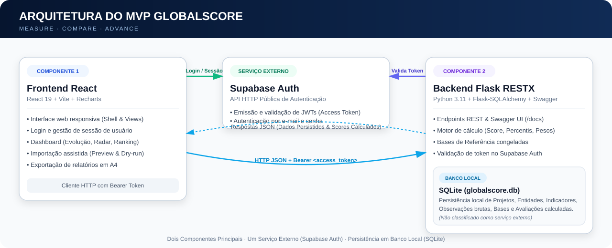

# GlobalScore — Frontend Web

> **MEASURE | COMPARE | ADVANCE**  
> Interface web responsiva do MVP GlobalScore para avaliação multicritério comparativa de desempenho, importação assistida de dados, dashboard executivo macro-micro, ranking entre entidades, série histórica de evolução e exportação de relatórios.



---

## 1. Visão Geral e Escopo Final

O **GlobalScore Frontend** é a camada de apresentação e interação do ecossistema GlobalScore. Toda a lógica de cálculo (percentis, pesos, elegibilidade, réguas estatísticas e Global Score) permanece centralizada na [API Backend GlobalScore](https://github.com/jorgeluispapiro-gif/globalscore-api). O frontend é responsável por guiar a experiência do usuário e apresentar diagnósticos claros e acionáveis.

### Funcionalidades Entregues no MVP Final:
- **Autenticação & Sessão**: Login por e-mail e senha integrado ao Supabase Auth, persistência de sessão, logout e rotas protegidas por Bearer token;
- **Gestão de Domínio**: Cadastro e edição visual de Projetos, Grupos de Comparação, Entidades e Indicadores (com suporte a desativação lógica);
- **Importação Assistida Incremental**: Workflow completo de upload CSV/XLSX com preview, mapeamento dinâmico de colunas, dry-run estatístico com alerta de outliers por 3 IQR e gravação em lote transacional;
- **Bases de Referência & Pesagem**: Visualização das estatísticas congeladas (min, máx, p10..p90) e interface de ajuste parametrizável de pesos dos indicadores;
- **Avaliações**: Execução de avaliações individuais e disparo em lote para todas as entidades de um grupo/base;
- **Dashboard Macro → Micro**:
  - Exibição de Global Score (0,0 a 10,0) com faixas conceituais e ratings;
  - Gráfico de Radar comparativo e Gráfico de Barras por indicador;
  - Ranking relativo entre entidades da mesma base e período;
  - Evolução histórica do Global Score ao longo do tempo por entidade;
  - Filtro e storytelling por Story View (Modo Entidade / Modo Período);
- **Eventos Gerenciais**: Exibição e registro de marcos de intervenção na linha do tempo;
- **Nota Executiva Determinística**: Síntese diagnóstica gerada automaticamente a partir dos dados do período e histórico;
- **Exportação A4**: Layout otimizado para impressão e geração de relatórios PDF executivos diretamente do navegador.

---

## 2. Tecnologias Utilizadas

- **Framework Web**: React 19, React Router 7
- **Ferramenta de Build**: Vite 8
- **Linguagem**: JavaScript (ESNext)
- **Visualização de Dados / Gráficos**: Recharts
- **Integração Auth Externa**: Supabase JavaScript Client (`@supabase/supabase-js`)
- **Estilização**: CSS Nativo modular com Tokens (`tokens.css`, `layout.css`, `global.css`) e tipografia IBM Plex Sans
- **Qualidade & Testes**: Vitest, React Testing Library, Oxlint

---

## 3. Estrutura do Repositório

```text
.
├── Dockerfile                  # Containerização do frontend (Node Alpine + Vite)
├── .dockerignore              # Exclusões para build Docker
├── README.md                  # Documentação do frontend
├── docs/                      # Documentos e diagramas de arquitetura (arquitetura.svg)
├── public/                    # Assets estáticos e favicons
├── src/
│   ├── assets/                # Logos e imagens da marca
│   ├── components/
│   │   ├── charts/            # Componentes Recharts (Radar, Barras, Evolução)
│   │   ├── dashboard/         # Cards, Ranking, Timeline e Controles de Story View
│   │   ├── layout/            # Shell principal, navegação e RotaProtegida
│   │   └── ui/                # Estados de carregamento, erro, alerta e vazio
│   ├── hooks/                 # Custom hooks (autenticação, projeto ativo)
│   ├── pages/                 # Páginas roteáveis (Dashboard, Avaliacoes, Importacoes, etc.)
│   ├── services/              # Cliente HTTP para API Flask (`api.js`) e Supabase Client (`supabase.js`)
│   ├── styles/                # CSS Tokens, variáveis e estilos globais
│   ├── test/                  # Configuração do Vitest
│   └── utils/                 # Funções utilitárias e gerador de narrativa executiva
└── vite.config.js             # Configuração do Vite e servidor de proxy local
```

---

## 4. Requisitos e Execução Local

### Pré-requisito
- **Node.js**: versão 20.19.0 ou superior (desenvolvido e testado em Node.js 24 LTS).

### Passo a Passo para Execução Local

1. Instale as dependências:
   ```bash
   npm install
   ```

2. Crie o arquivo `.env` a partir do exemplo fornecido:
   ```bash
   cp .env.example .env
   ```

3. Configure as variáveis de ambiente no `.env`:
   ```dotenv
   VITE_SUPABASE_URL=https://sua-instancia.supabase.co
   VITE_SUPABASE_PUBLISHABLE_KEY=sua_publishable_key
   VITE_GLOBALSCORE_API_URL=/api
   VITE_GLOBALSCORE_PROXY_TARGET=http://127.0.0.1:5000
   ```

4. Inicie o servidor de desenvolvimento:
   ```bash
   npm run dev
   ```

Abra a aplicação em **`http://localhost:5173`**.

> **Como funciona o Proxy Local**: O Vite redireciona requisições iniciadas com `/api` para a URL configurada em `VITE_GLOBALSCORE_PROXY_TARGET` (`http://127.0.0.1:5000` por padrão). Isso elimina problemas de CORS durante o desenvolvimento local. O backend Flask deve estar rodando para atender as requisições.

---

## 5. Comandos de Qualidade e Build

- **Executar Testes Automatizados**:
  ```bash
  npm test
  ```
  *(Suíte completa de ~38 testes cobrindo renderização de componentes, rotas protegidas, gráficos, tratamento de dados nulos e fluxos de importação)*

- **Executar Linter**:
  ```bash
  npm run lint
  ```

- **Gerar Build de Produção**:
  ```bash
  npm run build
  ```

---

## 6. Execução com Docker

O `Dockerfile` na raiz do repositório permite executar a aplicação em um container Node.js.

### Build da Imagem

```bash
docker build -t globalscore-frontend .
```

### Executar o Container

Ao rodar o container, informe o parâmetro `VITE_GLOBALSCORE_PROXY_TARGET` ou conecte os containers na mesma rede Docker:

```bash
docker run --rm -p 5173:5173 -e VITE_GLOBALSCORE_PROXY_TARGET=http://host.docker.internal:5000 globalscore-frontend
```

---

## 7. Comunicação com o Backend e Autenticação

### Fluxo de Autenticação Supabase Auth
1. O usuário digita e-mail e senha na tela `/login`;
2. O cliente Supabase (`src/services/supabase.js`) efetua a chamada à API externa do Supabase Auth;
3. Após o sucesso, o Supabase retorna um `access_token` JWT de sessão;
4. O `useAutenticacao` armazena o estado de sessão na aplicação;
5. O cliente de API (`src/services/api.js`) anexa automaticamente o cabeçalho `Authorization: Bearer <access_token>` em todas as chamadas HTTP enviadas ao backend Flask;
6. Caso o backend retorne HTTP 401 (token expirado ou inválido), o frontend encerra a sessão local e redireciona automaticamente para `/login`.

---

## 8. Arquitetura e Decisões de Design

- **Não-Recálculo de Regras**: O frontend é 100% receptivo e nunca recalcula estatísticas ou regras matemáticas no navegador, garantindo fidelidade com a API backend;
- **Tratamento de Dados Ausentes**: Indicadores ou períodos sem cálculo de Global Score exibem o estado legível `Global Score —` ou `Sem Global Score calculado`, sem induzir o usuário a erros com notas 0,0 fictícias;
- **Desativação Lógica**: Operações de exclusão de entidades ou indicadores solicitam confirmação visual e acionam desativação lógica no backend (`ativa: false`), preservando a rastreabilidade do histórico;
- **Design System Flexível**: Construído com tokens CSS nativos e variáveis modulares, permitindo fácil adequação visual e dark mode sem frameworks genéricos pesados.

---

## 9. Limitações Relevantes do MVP

1. **Dependência de Conectividade Externa**: O login exige acesso à internet para alcançar os servidores do Supabase Auth;
2. **Histórico Local de Proxy**: O proxy de desenvolvimento integrado ao Vite é voltado para ambiente de dev/teste local. Em implantação de produção final, recomenda-se servidor Nginx ou Caddy tratando o roteamento do bundle estático.
